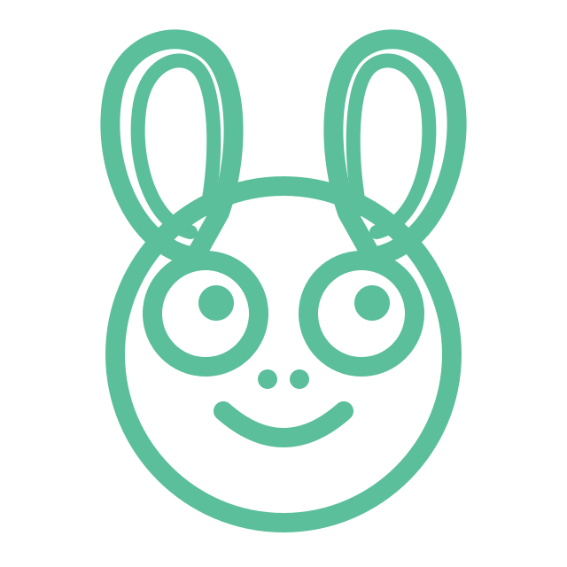

<div align="center">



# get-fable

### What if the coding agent you already use could work more like Claude Fable?

**Same model. Better working habits. A much stronger coding loop.**

[](https://www.npmjs.com/package/get-fable)
[](https://github.com/imMamdouhaboammar/get-fable/actions/workflows/ci.yml)
[](https://github.com/imMamdouhaboammar/get-fable/actions/workflows/security.yml)
[](https://github.com/imMamdouhaboammar/get-fable/actions/workflows/e2e.yml)
[](./LICENSE)

**25 connected Skills · routing · research · planning · TDD · verification · review · recovery · release**

```bash
bun add -g get-fable
```

[Start here](#start-in-under-a-minute) · [How it works](#so-what-does-get-fable-actually-do) · [The Skills](#25-skills-one-way-of-working) · [Docs](#documentation)

</div>

---

## I kept coming back to one question

What if you could take the coding agent you already have — Codex, Claude Code, Gemini, OpenCode, Cursor, a local model, a cheaper model, whatever you happen to use — and make it **work more like a serious coding partner**?

Not by swapping the model.

Not by writing one giant system prompt and hoping it still matters forty minutes later.

But by changing what happens *around* the model.

That question is where `get-fable` started.

Because when people talk about a great coding agent, they usually talk about the model first. And obviously the model matters. A lot.

But the model is not the whole experience.

A strong coding partner also knows when to inspect before touching anything. When to stop guessing and check the current docs. When a bug needs a failing test before a fix. When a task is large enough to plan. When two workers can genuinely work in parallel — and when they absolutely should not. When a green test is stale because the code changed afterward. When three failed attempts mean *rethink the diagnosis*, not *try a fourth variation of the same patch*.

That behavior is not just raw intelligence.

A lot of it is **the harness**.

`get-fable` is an attempt to bring that harness to almost any coding agent.

> **The goal is deliberately ambitious: take the agent you already use and push its working behavior closer to the discipline you expect from a top-tier coding partner.**

No, it does not magically turn a small local model into Claude Fable.

But it can give that model a better way to approach real software work.

And when the model underneath is already strong, the harness has more to work with.

---

## The model is only part of the agent

Two agents can use completely different models and still make the same mistakes.

They can both start editing too early.

They can both lose the original plan halfway through a long task.

They can both rely on stale knowledge about an API.

They can both patch a bug without proving the bug first.

They can both run tests, change five more files, and still treat the old test run as proof.

They can both split work across subagents because the files look different while the workers are quietly changing the same contract.

They can both keep retrying an approach that clearly is not working.

And they can both end with the most dangerous sentence in agentic coding:

**“Done.”**

`get-fable` works on that part of the problem.

It does not replace the model.

It surrounds it with a way of working.

```text
YOUR CODING AGENT
       +
GET-FABLE HARNESS
       ↓
DISCOVER
RESEARCH
PLAN
TEST
DELEGATE
EXECUTE
VERIFY
REVIEW
SECURITY
RECOVER
RELEASE
       ↓
A MORE DISCIPLINED CODING LOOP
```

---

## So what does get-fable actually do?

It gives the agent 25 connected specialist Skills and a lifecycle that decides when each one should take over.

A normal bug request should not immediately mean “edit production code.”

```text
"Fix the token refresh race condition"

        ↓

Where does the behavior actually live?
        ↓
Can we reproduce it reliably?
        ↓
What test level crosses the real failure boundary?
        ↓
Did RED fail for the right reason?
        ↓
Make the smallest production change
        ↓
Fresh GREEN
        ↓
Probe adjacent race/error paths
        ↓
Verify the current mutation
        ↓
Review the actual diff
```

A release request follows a different route.

An unfamiliar SDK should trigger current primary-source research before implementation.

A repeated failure should stop mutation and enter diagnosis.

A security-sensitive change should be traced through trust boundaries, not waved through because a scanner came back clean.

The workflow follows the work.

---

## This is not a prompt pack

This distinction matters.

A prompt can say:

> verify your work

`get-fable` can track that the repository changed **after** verification and treat the old evidence as stale.

A prompt can say:

> use TDD

`fable-tdd` now distinguishes a valid RED from a syntax error, a broken fixture, a stale artifact, a false-green mock, or a concurrency test that only passes because it slept long enough.

A prompt can say:

> use subagents

`fable-delegate` asks whether the work is independent at the **semantic** level, not just whether two workers touch different files.

A prompt can say:

> debug carefully

`fable-recover` freezes blind mutation, builds a ranked hypothesis queue, chooses discriminating probes, falsifies bad theories, and only then issues one bounded repair.

A prompt can say:

> make sure the release works

`fable-release` separates source correctness from the artifact users actually install, then distinguishes `READY_NOT_PUBLISHED`, `PUBLISHED_UNVERIFIED`, and genuinely `RELEASED`.

That is the direction of the project: not more instructions, but **more operational judgment around the instructions**.

---

## Deep Skill Playbooks V2

The original Skills were useful, but too many of them were still basically compact checklists.

V2 changes that.

Every canonical Skill is now expected to carry its own operating knowledge:

- when it should activate — and when it should refuse or defer;
- how to classify the situation before acting;
- decision branches for ambiguous cases;
- a staged execution/evidence protocol;
- invariants that must stay true;
- a failure taxonomy that changes the next action;
- tempting anti-patterns the agent must avoid;
- an explicit handoff/receipt format;
- deeper progressive references for hard cases;
- multiple semantically different evaluation families.

And this is enforced in the repository. The authoring lint rejects a V2 Skill that falls back to a shallow happy-path recipe, tiny duplicated reference, or token collection of near-identical eval prompts.

The point is simple: **if a weaker model is going to benefit from the harness, the hard-earned reasoning needs to live in the Skill — not in assumptions about what the model already knows.**

---

## 25 Skills. One way of working.

### Understand the work

`get-fable` — choose the next specialist from intent + durable state, with precedence for failure, security, stale proof, and unknowns.

`fable-discover` — trace real repository/runtime execution paths instead of guessing from filenames and imports.

`fable-research` — resolve current external facts against version-appropriate primary sources.

`fable-plan` — turn evidence into dependency-aware, risk-aware, falsifiable work cards.

### Build the change

`fable-tdd` — prove the behavior gap through the right test boundary before production mutation.

`fable-delegate` — parallelize only when write, semantic, and verification independence are real.

`fable-execute` — implement one bounded card while protecting scope, source-of-truth, and user work.

`fable-simplify` — reduce complexity without quietly changing behavior.

### Prove it

`fable-verify` — build a claim → failure mode → evidence matrix and try to falsify the implementation.

`fable-review` — inspect the actual diff for concrete failure scenarios instead of style-comment theater.

`fable-security` — trace attacker-controlled input across trust boundaries and validate findings skeptically.

`fable-simulator` — compare against an independent oracle without confusing simulation with production proof.

`fable-eval` — measure changes to agent behavior without benchmark overfitting or oracle leakage.

### Keep long sessions sane

`fable-recover` — stop blind retries and rebuild causal confidence after repeated failure.

`fable-spark` — suggest the smallest useful next move — or stay silent when another suggestion would just be noise.

`fable-memory` — preserve durable facts with scope, provenance, supersession, and secret-safe rules.

`fable-handoff` — create a real resumability contract for another agent/session.

`fable-cowork` — execute long scoped work autonomously without throwing away lifecycle gates or authorization boundaries.

`fable-loop` — poll changing conditions with explicit state machines, budgets, backoff, and honest stop reasons.

### Work with the environment

`fable-run` — launch the exact runtime artifact and separate spawn, readiness, feature proof, and cleanup.

`fable-config` — change harness settings with precedence, least privilege, host-capability honesty, and behavioral verification.

### Build evidence people can use

`fable-dataviz` — choose truthful visual encodings, preserve metric semantics, and audit for misleading scales/transformations.

`fable-artifact` — produce source-grounded documents and diagrams that survive outside the conversation.

### Extend the harness

`skill-creator` — author new Skills to the same V2 standard instead of cloning shallow templates.

[Explore the canonical Skill catalog →](docs/CANONICAL_SKILLS.md)

---

## Fable Spark: sometimes the best next move is tiny

During a long coding session, the agent usually does not need another page of advice.

It needs one useful move.

```text
reproduce the bug
check the exact installed SDK version
write the failing contract test
compare source and built entrypoints
review the current diff
rerun evidence after the last mutation
stop retrying and diagnose
```

Or nothing.

Spark is explicitly allowed to stay silent when the current specialist already owns an obvious next step.

```bash
get-fable spark
```

---

## Works with the coding agent you already use

`get-fable` is portable across multiple coding-agent environments and IDEs rather than being tied to one model or editor.

| Agent / IDE | Integration Tier | Key Capabilities |
|:---|:---|:---|
|  **Claude Code** | **Full Lifecycle** | 5 Python hooks (`settings.json`), 25 skills, rules in `CLAUDE.md`, Marketplace plugin |
|  **Google Antigravity & Gemini** | **Full Lifecycle** | `hooks.json` lifecycle triggers, plugin manifest, canonical skills, constitution rules |
|  **OpenAI Codex & ChatGPT** | **Skill + Rule + Plugin** | `.codex-plugin/plugin.json`, ChatGPT OpenAPI Custom Actions, skills in `~/.codex/skills/` |
|  **Cursor IDE** | **Advisory Rule + Plugin** | `.cursor/rules/fable-lifecycle.mdc`, `.cursor-plugin/marketplace.json` |
|  **OpenCode** | **Skill + Rule** | Rules in `~/.opencode/rules/fable.md`, skills in `~/.opencode/skills/` |
|  **DeepSeek Harness (DSH)** | **Advisory Rule** | Rules in `~/.deepseek/rules/fable.md` |
|  **Moonshot Kimi Code** | **Advisory Rule** | Rules in `~/.kimi/rules/fable.md` |
|  **Kiro** | **Rule + Hooks** | Rules in `~/.kiro/rules/fable.md` and lifecycle triggers |
|  **Pi Code** | **Advisory Rule** | Rules in `~/.pi/rules/fable.md` |
|  **VS Code** | **IDE & Editor Support** | Direct execution via Bun/Node CLI, task state inspector, and terminal hooks |
|  **Windsurf** | **IDE & Editor Support** | Direct execution via Bun/Node CLI, task state inspector, and terminal hooks |

Integration depth depends on what each host actually exposes:

- **Full lifecycle integration** — Claude Code, Antigravity
- **Skill + rule integration** — Codex, OpenCode
- **Advisory rule integration** — Cursor, Kiro, Kimi, DeepSeek, Pi Code

That distinction is intentional. A host that can load rules but cannot register lifecycle hooks should not be described as if it has enforcement it does not actually provide.

[See the host capability matrix →](hosts/README.md)

<details>
<summary><strong>Installation commands by host</strong></summary>

```bash
get-fable install all
get-fable install claude
get-fable install antigravity
get-fable install codex
get-fable install cursor
get-fable install opencode
get-fable install kimi
get-fable install deepseek
get-fable install kiro
get-fable install pi
```

Claude Code marketplace installation:

```bash
/plugin marketplace add imMamdouhaboammar/get-fable
/plugin install get-fable@get-fable
```

</details>

---

## Start in under a minute

### 1. Vercel / skills.sh CLI (Direct Skill Pack)
```bash
npx skills add imMamdouhaboammar/get-fable
# or
bunx skills add imMamdouhaboammar/get-fable
```

### 2. Homebrew (macOS & Linux)
```bash
brew tap imMamdouhaboammar/get-fable
brew install get-fable
```

### 3. Global Package Manager
```bash
bun add -g get-fable
# or
npm install -g get-fable
```

### 4. Configure All Coding Agents
```bash
get-fable install all
# Configures Claude Code, Google Antigravity, OpenAI Codex/ChatGPT, Cursor, OpenCode, Kimi, DeepSeek, Kiro, Pi
```

Inside a project:

```bash
cd your-project
get-fable init
```

Route a real task:

```bash
get-fable route "Fix the checkout race condition and verify it with a regression test"
```

Ask for the next useful move:

```bash
get-fable spark
```

Check installation, contracts, and evidence state:

```bash
get-fable doctor
```

> 📖 **Full Multi-Host & Platform Guide**: See [docs/INSTALLATION.md](./docs/INSTALLATION.md) for detailed configuration of hooks, shell completions, and individual agent environments.

---

## Behavioral proof: the uncomfortable part is intentional

`get-fable` treats **“the Skill exists”** and **“the Skill has been proven to behave correctly”** as different claims.

A previous version of the catalog had an external-provider evidence run across 115 blinded cases with 115 passes and zero forbidden-action violations.

That run is useful history.

It is **not** fresh proof for Deep Skill Playbooks V2.

V2 materially changes the instructions and expands the semantic scenario corpus. The evidence hashes should therefore make the old behavioral result stale.

That is a feature, not a regression.

Until the current V2 request bundle is executed against an independent provider and rescored, affected behavioral maturity should remain **`NOT_CHECKED`**, not magically inherit the old M4 badge.

The current workflow is:

```bash
get-fable behavior-eval export --out /tmp/get-fable-behavior-requests.json
# execute the blinded requests with an independent provider
get-fable behavior-eval score /tmp/provider-responses.json \
  --out evals/results/agent-behavior-v1.json
get-fable behavior-eval status
get-fable doctor --json-v1
```

The exported bundle is generated from the current Skill corpus, so the README deliberately does not hard-code a V2 request count.

[Read the behavioral evidence protocol →](docs/BEHAVIOR_EVIDENCE.md)

---

## Local-first by default

`get-fable` is designed to add process without turning your repository into a telemetry product.

- telemetry is disabled by default;
- state and evidence live locally with the project;
- the CLI has zero production npm dependencies;
- Skill installation rejects traversal and symlink escapes;
- the local proxy binds to loopback by default;
- GitHub Actions are pinned to immutable commit SHAs;
- CodeQL, Dependency Review, TruffleHog, and E2E workflows are part of the repository quality surface.

For the full trust boundary, see [SECURITY.md](SECURITY.md).

---

## A few commands you will actually use

```bash
get-fable init
get-fable route "your task"
get-fable spark
get-fable doctor
get-fable feed list
get-fable graph
get-fable recipes
get-fable packs
get-fable behavior-eval status
```

Legacy `--json` output remains available, while supported commands can use the additive versioned `--json-v1` envelope.

[Read the usage guide →](docs/USAGE.md)

---

## Distribution

- **npm** — [`get-fable`](https://www.npmjs.com/package/get-fable)
- **GitHub Releases** — [release history](https://github.com/imMamdouhaboammar/get-fable/releases)
- **Homebrew formula** — [`Formula/get-fable.rb`](Formula/get-fable.rb)
- **Agent packaging** — Claude, Codex, Gemini, Cursor, OpenCode, Kimi, DeepSeek, Kiro, and Pi manifests ship with the project/package

---

## Documentation

The README tells the product story. The implementation details live here:

- [Getting started and CLI usage](docs/USAGE.md)
- [Canonical Skills](docs/CANONICAL_SKILLS.md)
- [Host compatibility](docs/COMPATIBILITY.md)
- [Behavioral evidence](docs/BEHAVIOR_EVIDENCE.md)
- [Architecture](docs/ARCHITECTURE.md)
- [Plugin distribution](docs/PLUGIN.md)
- [Release process](docs/RELEASE.md)
- [Security](SECURITY.md)
- [Support](SUPPORT.md)
- [Contributing](CONTRIBUTING.md)

---

<div align="center">

## A better model helps.

### A better harness helps too.

```bash
bun add -g get-fable
get-fable init
```

[Get started](docs/USAGE.md) · [Explore the Skills](docs/CANONICAL_SKILLS.md) · [View releases](https://github.com/imMamdouhaboammar/get-fable/releases) · [Report an issue](https://github.com/imMamdouhaboammar/get-fable/issues)

<br/>

MIT licensed

<sub>get-fable is an independent open-source project and is not affiliated with Anthropic.</sub>

</div>
