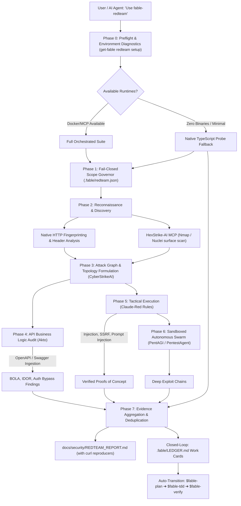

# Implementation Plan: Fable RedTeam Unified Agentic Orchestrator

## Overview

Transform `fable-redteam` into the **Master Orchestrator** for state-of-the-art ethical offensive security tools. 

Instead of reinventing security tooling from scratch or requiring the user to manually install and juggle disparate frameworks, `fable-redteam` provides a unified agentic facade. The user (or any connected AI agent such as Claude, Antigravity, Cursor, Codex) simply issues a single instruction:
> *"Use fable-redteam to test my application"*

`fable-redteam` automatically handles environment preflight, containerized sandboxing, MCP tool integration, attack-graph generation, API business logic testing, cognitive playbook execution, and closed-loop vulnerability remediation via Fable work cards (`.fable/LEDGER.md` ➔ `$fable-plan` ➔ `$fable-tdd`).

---

## The 6 Integrated Systems & Orchestration Roles

| System | Upstream Source | Primary Role in Orchestration | Integration Method |
|---|---|---|---|
| **0x4m4/HexStrike-AI** | [hexstrike-ai](https://github.com/0x4m4/hexstrike-ai) | **Tool Context & Execution Gateway** (150+ security tools: Nmap, Nuclei, FFuf, SQLMap, Nikto, etc.) | MCP Server configuration generator (`.cursor/mcp.json`, `.gemini/settings.json`, Claude Code) & Docker CLI runner. |
| **akto-api-security/akto** | [akto](https://github.com/akto-api-security/akto) | **Automated API Business Logic & OWASP API Top 10** (BOLA, IDOR, Broken Auth, Mass Assignment) | Ingests repository OpenAPI / Swagger schemas or proxies traffic via local testing container. |
| **SnailSploit/Claude-Red** | [Claude-Red](https://github.com/SnailSploit/Claude-Red) | **Cognitive Red Team Playbooks & Prompt Defenses** | Structured tactical playbooks in `skills/fable-redteam/references/claude-red/` and cognitive reasoning prompts. |
| **AIPentest/CyberStrikeAI** | [CyberStrikeAI](https://github.com/AIPentest/CyberStrikeAI) | **Multi-Stage Attack Graph & Kill-Chain Pathing** | Graph modeling engine prioritizing highest-impact attack paths from recon evidence. |
| **vxcontrol/pentagi** | [pentagi](https://github.com/vxcontrol/pentagi) | **Sandboxed Autonomous Multi-Agent Swarm** | Isolated Docker sandbox runner for exploratory autonomous attacks. |
| **GH05TCREW/pentestagent** | [pentestagent](https://github.com/GH05TCREW/pentestagent) | **Terminal / Interactive Pentest Driver** | Interactive execution loop adapter for dynamic terminal payloads. |

---

## User Review Required

> [!IMPORTANT]
> **Container Runtime Policy:** Per workspace rules, **Colima is strictly prohibited**. `get-fable redteam setup` checks for Docker Desktop, OrbStack, or native Podman runtimes, and will explicitly abort if Colima is detected.

> [!IMPORTANT]
> **Safe-Mode & Fail-Closed Boundaries:** By default, all scans run in `safe-mode: true` with strict rate limiting, non-destructive payloads (no data deletion, no DoS), and scoped exclusively to target origins defined in `.fable/redteam.json`.

> [!TIP]
> **Zero-Friction Fallback:** If Docker or external heavy tools are not installed on the user's host, the engine gracefully falls back to the **built-in Native TypeScript Probe** (already implemented in PR #160), ensuring security testing is always functional out of the box with zero external dependencies.

---

## End-to-End Orchestrated Pipeline



---

## Proposed Changes

### Component 1: `get-fable redteam setup` & Environment Provisioning

#### [NEW] [src/core/redteam/setup.ts](file:///Users/mamdouhaboammar/Documents/DDAAYY-dDEEVV/GET-FABLE/src/core/redteam/setup.ts)
- System diagnostic checks:
  - Docker / Podman availability (verifying container runtime, fail-fast if Colima detected).
  - Python 3 / Pip / uv availability for external tools.
  - MCP Host detection (`~/.cursor/mcp.json`, `.gemini/settings.json`, Claude Code configs).
- Automated provisioning:
  - Generates `.fable/redteam/docker-compose.yml` for isolated container execution (Akto, PentAGI, HexStrike).
  - Generates MCP server wiring file `.fable/redteam/mcp-config.json` ready for one-click agent integration.
  - Generates default target scope contract `.fable/redteam.json`.

#### [NEW] [src/core/redteam/docker-compose.template.ts](file:///Users/mamdouhaboammar/Documents/DDAAYY-dDEEVV/GET-FABLE/src/core/redteam/docker-compose.template.ts)
- Embedded template for local isolated Docker Compose network containing:
  - `hexstrike-mcp`: lightweight container exposing HexStrike security tools via MCP.
  - `akto-mini`: lightweight container for running Akto API test executions.
  - `pentagi-sandbox`: isolated sandbox container with restricted network access for autonomous agent runs.

---

### Component 2: Modular Tool Adapter Architecture

#### [NEW] [src/core/redteam/adapters/base.ts](file:///Users/mamdouhaboammar/Documents/DDAAYY-dDEEVV/GET-FABLE/src/core/redteam/adapters/base.ts)
- `RedTeamToolAdapter` interface:
  - `id`: identifier (`hexstrike`, `akto`, `pentagi`, `pentestagent`, `cyberstrike`, `claude-red`).
  - `isAvailable()`: non-blocking check whether tool/container/mcp is reachable.
  - `setup()`: configuration and health initialization.
  - `run()`: execution returning normalized `VulnerabilityFinding[]`.

#### [NEW] [src/core/redteam/adapters/hexstrike.ts](file:///Users/mamdouhaboammar/Documents/DDAAYY-dDEEVV/GET-FABLE/src/core/redteam/adapters/hexstrike.ts)
- Connects to HexStrike-AI MCP server or container.
- Translates security tool outputs (Nuclei templates, Nmap port banners, FFuf paths) into typed Fable findings with exact reproducible commands.

#### [NEW] [src/core/redteam/adapters/akto.ts](file:///Users/mamdouhaboammar/Documents/DDAAYY-dDEEVV/GET-FABLE/src/core/redteam/adapters/akto.ts)
- Ingests repository OpenAPI / Swagger files (`openapi.json`, `swagger.yaml`, etc.).
- Executes API business logic tests against targeted endpoints.
- Detects BOLA, IDOR, auth token bypass, and schema mismatches.

#### [NEW] [src/core/redteam/adapters/cyberstrike.ts](file:///Users/mamdouhaboammar/Documents/DDAAYY-dDEEVV/GET-FABLE/src/core/redteam/adapters/cyberstrike.ts)
- Attack graph formulation: builds node/edge attack topologies from discovered services.
- Prioritizes attack paths based on CVSS score and exploit probability.

#### [NEW] [src/core/redteam/adapters/pentagi.ts](file:///Users/mamdouhaboammar/Documents/DDAAYY-dDEEVV/GET-FABLE/src/core/redteam/adapters/pentagi.ts) & [src/core/redteam/adapters/pentestagent.ts](file:///Users/mamdouhaboammar/Documents/DDAAYY-dDEEVV/GET-FABLE/src/core/redteam/adapters/pentestagent.ts)
- Sandboxed autonomous agent loop runner with timeout and abort controllers.
- Captures command transcripts and raw output receipts.

---

### Component 3: Claude-Red Cognitive Tactical Playbooks

#### [NEW] [src/core/redteam/playbooks/index.ts](file:///Users/mamdouhaboammar/Documents/DDAAYY-dDEEVV/GET-FABLE/src/core/redteam/playbooks/index.ts)
- Structured tactical reasoning rules compiled from `SnailSploit/Claude-Red`:
  - `api-logic`: Parameter manipulation, horizontal IDOR, BFLA, JWT manipulation.
  - `injection`: SQLi, NoSQLi, command injection, SSRF.
  - `llm-security`: Prompt injection, jailbreak resistance, data leakage, indirect injection.
  - `auth-session`: Session fixation, CSRF, OAuth redirect manipulation, token replay.

#### [NEW] [skills/fable-redteam/references/claude-red-tactics.md](file:///Users/mamdouhaboammar/Documents/DDAAYY-dDEEVV/GET-FABLE/skills/fable-redteam/references/claude-red-tactics.md)
- Markdown reference documentation instructing LLM agents how to reason step-by-step through tactical ethical hacking phases.

#### [NEW] [skills/fable-redteam/references/tool-orchestration.md](file:///Users/mamdouhaboammar/Documents/DDAAYY-dDEEVV/GET-FABLE/skills/fable-redteam/references/tool-orchestration.md)
- Explains the orchestration flow across HexStrike, Akto, PentAGI, CyberStrikeAI, and PentestAgent.

---

### Component 4: Unified Master Orchestrator Engine

#### [MODIFY] [src/core/redteam/engine.ts](file:///Users/mamdouhaboammar/Documents/DDAAYY-dDEEVV/GET-FABLE/src/core/redteam/engine.ts)
- Upgrade `RedTeamEngine` to orchestrate registered adapters:
  - Runs pre-flight adapter availability check.
  - Orchestrates pipeline: Recon ➔ Attack Graph ➔ Akto API Logic ➔ Playbook Execution ➔ Aggregation.
  - Generates unified findings deduplicated across tools.

#### [MODIFY] [src/core/redteam/cli.ts](file:///Users/mamdouhaboammar/Documents/DDAAYY-dDEEVV/GET-FABLE/src/core/redteam/cli.ts)
- Add new subcommands:
  - `get-fable redteam setup [--start] [--mcp]`: Diagnoses and provisions tools/containers/MCP configs.
  - `get-fable redteam status`: Displays readiness and health of all 6 integrated tools.
  - `get-fable redteam scan`: Enhanced to support `--orchestrate` mode running all available adapters.
  - `get-fable redteam fix`: Converts findings into `.fable/LEDGER.md` work cards for remediation.

---

### Component 5: Tests & Quality Gates

#### [NEW] [test/redteam-setup.test.ts](file:///Users/mamdouhaboammar/Documents/DDAAYY-dDEEVV/GET-FABLE/test/redteam-setup.test.ts)
- Tests setup diagnostics, Docker template generation, MCP config generation, and Colima prohibition invariant.

#### [NEW] [test/redteam-adapters.test.ts](file:///Users/mamdouhaboammar/Documents/DDAAYY-dDEEVV/GET-FABLE/test/redteam-adapters.test.ts)
- Tests adapter fallback behavior, mock HexStrike tool parsing, mock Akto OpenAPI ingest, and findings normalization.

#### [NEW] [test/redteam-orchestration.test.ts](file:///Users/mamdouhaboammar/Documents/DDAAYY-dDEEVV/GET-FABLE/test/redteam-orchestration.test.ts)
- Tests end-to-end multi-stage pipeline flow with mock servers and verifies evidence generation.

---

## Verification Plan

### Automated Tests
```bash
# 1. Test RedTeam setup and adapter suites
bun test test/redteam-setup.test.ts test/redteam-adapters.test.ts test/redteam-orchestration.test.ts

# 2. Run existing RedTeam probe and scope suites
bun test test/redteam-*.test.ts

# 3. Full workspace integrity gate
bun run typecheck
bun test
bun run build
bun run ./bin/get-fable.js doctor --json
```

### Manual Verification
- Execute `get-fable redteam setup` in dry-run mode to verify generated `.fable/redteam/docker-compose.yml` and MCP configs.
- Run `get-fable redteam status` to verify tool discovery.
- Run `get-fable redteam scan --target http://127.0.0.1:3000 --profile api-logic` against a local test service to confirm finding output and `.fable/LEDGER.md` work card generation.
