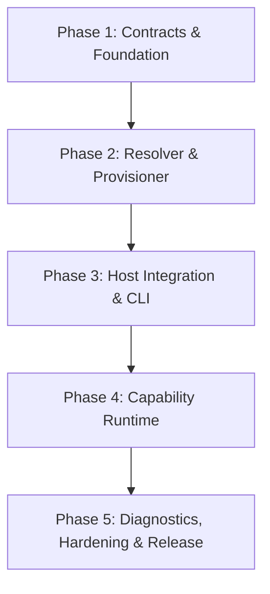

# Fable Eco: Curated Capability Distribution & Execution-Control Subsystem

## Overview
Implement the full production-grade `fable-eco` subsystem specified in [`docs/fable-eco-production-spec`](file:///Users/mamdouhaboammar/Documents/DDAAYY-dDEEVV/GET-FABLE/docs/fable-eco-production-spec).

`fable-eco` is a curated capability distribution and execution-control subsystem for `get-fable`. Following the core principle **"install many, activate few"**, it separates distribution (discovery, deterministic dependency/conflict resolution, transaction journaling, allowlisted drivers, rollback, reproducible locks) from agent runtime execution (mapping routed tasks to minimal capabilities via playbooks, explicit execution contracts, layered policies, host exposure compilation, and evidence bridging into get-fable).

This plan adheres strictly to:
- `/get-fable`: Canonical lifecycle routing, durable `.fable` state, mutation generation awareness, evidence gates.
- `/ponytail`: Lazy senior-dev efficiency — stdlib first, lowest working code footprint, zero unrequested speculative abstractions, delete over add.
- `/clean-code-guard`: Functions ≤ 20 LoC, params ≤ 4, cyclomatic ≤ 10, no swallowed errors, no fake fixtures in production, strict trust-boundary guards.
- `/test-guard`: Behavior over implementation, minimal justified boundary mocks, real state objects, one scenario per test.

---

## User Review Required

> [!IMPORTANT]
> **Zero Lifecycle Drift**: `fable-core` retains sole ownership over task routing, lifecycle phases, durable work state, and completion evidence rules. `fable-eco` acts purely as a capability provider and executor subordinate to `fable-core` routing decisions.

> [!IMPORTANT]
> **Allowlisted Native Drivers Only**: Per spec FR-02 & FR-05, arbitrary shell scripts in official manifests are prohibited. All installation operations use compiled Rust drivers (`copy_skill`, `git_checkout`, `github_release`, `package_manager`).

---

## Proposed Changes & Phased Execution

The implementation is partitioned into 5 sequential phases matching the architecture plans in `docs/fable-eco-production-spec/plans/`:



---

### Phase 1: Contracts and Foundation (Plan 01)

Establish the new Rust crate, canonical schemas, data models, catalog loader, profile expansion, and canonical skill.

#### [NEW] [crates/fable-eco/Cargo.toml](file:///Users/mamdouhaboammar/Documents/DDAAYY-dDEEVV/GET-FABLE/crates/fable-eco/Cargo.toml)
#### [NEW] [crates/fable-eco/src/lib.rs](file:///Users/mamdouhaboammar/Documents/DDAAYY-dDEEVV/GET-FABLE/crates/fable-eco/src/lib.rs)
#### [NEW] [crates/fable-eco/src/error.rs](file:///Users/mamdouhaboammar/Documents/DDAAYY-dDEEVV/GET-FABLE/crates/fable-eco/src/error.rs)
- Library crate with typed `EcoError` / `EcoResult<T>`.
- Dependencies: `serde`, `serde_json`, `toml`, `semver`, `sha2`, `thiserror`, `chrono`, `regex`, `fs2`, `tempfile`.

#### [MODIFY] [Cargo.toml](file:///Users/mamdouhaboammar/Documents/DDAAYY-dDEEVV/GET-FABLE/Cargo.toml)
- Add `"crates/fable-eco"` to workspace members.

#### [NEW] [crates/fable-eco/src/model/mod.rs](file:///Users/mamdouhaboammar/Documents/DDAAYY-dDEEVV/GET-FABLE/crates/fable-eco/src/model/mod.rs)
#### [NEW] [crates/fable-eco/src/model/capability.rs](file:///Users/mamdouhaboammar/Documents/DDAAYY-dDEEVV/GET-FABLE/crates/fable-eco/src/model/capability.rs)
- Strongly typed `CapabilityId` (`<namespace>/<name>`), `CapabilityKind`, `SupportTier`, `Permission`, `ConflictKind`, `CapabilityManifest`.

#### [NEW] [schemas/eco/](file:///Users/mamdouhaboammar/Documents/DDAAYY-dDEEVV/GET-FABLE/schemas/eco/)
- Install all 14 canonical JSON schemas from `docs/fable-eco-production-spec/schemas/`:
  - `capability-manifest.schema.json`, `profile.schema.json`, `policy.schema.json`, `lockfile.schema.json`, `install-plan.schema.json`, `execution-contract.schema.json`, `project-binding.schema.json`, `playbook.schema.json`, `inventory.schema.json`, `transaction-journal.schema.json`, `receipt.schema.json`, `capability-result.schema.json`, `host-capability-matrix.schema.json`, `qualification-record.schema.json`.

#### [NEW] [crates/fable-eco/src/catalog/validate.rs](file:///Users/mamdouhaboammar/Documents/DDAAYY-dDEEVV/GET-FABLE/crates/fable-eco/src/catalog/validate.rs)
#### [NEW] [crates/fable-eco/src/catalog/load.rs](file:///Users/mamdouhaboammar/Documents/DDAAYY-dDEEVV/GET-FABLE/crates/fable-eco/src/catalog/load.rs)
#### [NEW] [crates/fable-eco/src/catalog/merge.rs](file:///Users/mamdouhaboammar/Documents/DDAAYY-dDEEVV/GET-FABLE/crates/fable-eco/src/catalog/merge.rs)
#### [NEW] [crates/fable-eco/src/catalog/profile.rs](file:///Users/mamdouhaboammar/Documents/DDAAYY-dDEEVV/GET-FABLE/crates/fable-eco/src/catalog/profile.rs)
- Semantic validation: reject self-dependencies, duplicate features, mutable stable revisions, invalid URLs.
- Catalog loader with bounded file reading, deterministic sorting, and precedence merging.
- Profile inheritance expansion with cycle detection.

#### [NEW] [eco/profiles/core.toml](file:///Users/mamdouhaboammar/Documents/DDAAYY-dDEEVV/GET-FABLE/eco/profiles/core.toml)
#### [NEW] [eco/profiles/frontend.toml](file:///Users/mamdouhaboammar/Documents/DDAAYY-dDEEVV/GET-FABLE/eco/profiles/frontend.toml)
#### [NEW] [eco/profiles/research.toml](file:///Users/mamdouhaboammar/Documents/DDAAYY-dDEEVV/GET-FABLE/eco/profiles/research.toml)
#### [NEW] [eco/profiles/security.toml](file:///Users/mamdouhaboammar/Documents/DDAAYY-dDEEVV/GET-FABLE/eco/profiles/security.toml)

#### [NEW] [skills/fable-eco/SKILL.md](file:///Users/mamdouhaboammar/Documents/DDAAYY-dDEEVV/GET-FABLE/skills/fable-eco/SKILL.md)
#### [MODIFY] [skills/get-fable/registry.json](file:///Users/mamdouhaboammar/Documents/DDAAYY-dDEEVV/GET-FABLE/skills/get-fable/registry.json)
- Register `fable-eco` skill, regenerate catalogs with `bun run generate:catalog`.

---

### Phase 2: Discovery, Resolution & Provisioner (Plan 02)

Build side-effect free environment discovery, deterministic graph resolution, write-ahead transaction journaling, allowlisted drivers, rollback, and reproducible lock writing.

#### [NEW] [crates/fable-eco/src/model/machine.rs](file:///Users/mamdouhaboammar/Documents/DDAAYY-dDEEVV/GET-FABLE/crates/fable-eco/src/model/machine.rs)
#### [NEW] [crates/fable-eco/src/discover/mod.rs](file:///Users/mamdouhaboammar/Documents/DDAAYY-dDEEVV/GET-FABLE/crates/fable-eco/src/discover/mod.rs)
#### [NEW] [crates/fable-eco/src/discover/platform.rs](file:///Users/mamdouhaboammar/Documents/DDAAYY-dDEEVV/GET-FABLE/crates/fable-eco/src/discover/platform.rs)
#### [NEW] [crates/fable-eco/src/discover/runtime.rs](file:///Users/mamdouhaboammar/Documents/DDAAYY-dDEEVV/GET-FABLE/crates/fable-eco/src/discover/runtime.rs)
#### [NEW] [crates/fable-eco/src/discover/host.rs](file:///Users/mamdouhaboammar/Documents/DDAAYY-dDEEVV/GET-FABLE/crates/fable-eco/src/discover/host.rs)
- Typed `MachineFacts` with `Fact<T>` (`Present`, `Absent`, `Unknown`, `Error`).
- Bounded, side-effect free subprocess & env probes (OS, Arch, Git, Bun, Rust, Python, package managers, hosts).

#### [NEW] [crates/fable-eco/src/resolve/mod.rs](file:///Users/mamdouhaboammar/Documents/DDAAYY-dDEEVV/GET-FABLE/crates/fable-eco/src/resolve/mod.rs)
#### [NEW] [crates/fable-eco/src/resolve/compatibility.rs](file:///Users/mamdouhaboammar/Documents/DDAAYY-dDEEVV/GET-FABLE/crates/fable-eco/src/resolve/compatibility.rs)
#### [NEW] [crates/fable-eco/src/resolve/dependency.rs](file:///Users/mamdouhaboammar/Documents/DDAAYY-dDEEVV/GET-FABLE/crates/fable-eco/src/resolve/dependency.rs)
#### [NEW] [crates/fable-eco/src/resolve/conflict.rs](file:///Users/mamdouhaboammar/Documents/DDAAYY-dDEEVV/GET-FABLE/crates/fable-eco/src/resolve/conflict.rs)
#### [NEW] [crates/fable-eco/src/resolve/version.rs](file:///Users/mamdouhaboammar/Documents/DDAAYY-dDEEVV/GET-FABLE/crates/fable-eco/src/resolve/version.rs)
#### [NEW] [crates/fable-eco/src/resolve/planner.rs](file:///Users/mamdouhaboammar/Documents/DDAAYY-dDEEVV/GET-FABLE/crates/fable-eco/src/resolve/planner.rs)
- Compatibility checks, dependency DAG expansion with cycle detection, hard-conflict elimination, immutable version resolution, and topological plan generation.

#### [NEW] [crates/fable-eco/src/install/transaction.rs](file:///Users/mamdouhaboammar/Documents/DDAAYY-dDEEVV/GET-FABLE/crates/fable-eco/src/install/transaction.rs)
#### [NEW] [crates/fable-eco/src/install/journal.rs](file:///Users/mamdouhaboammar/Documents/DDAAYY-dDEEVV/GET-FABLE/crates/fable-eco/src/install/journal.rs)
#### [NEW] [crates/fable-eco/src/install/staging.rs](file:///Users/mamdouhaboammar/Documents/DDAAYY-dDEEVV/GET-FABLE/crates/fable-eco/src/install/staging.rs)
#### [NEW] [crates/fable-eco/src/install/cache.rs](file:///Users/mamdouhaboammar/Documents/DDAAYY-dDEEVV/GET-FABLE/crates/fable-eco/src/install/cache.rs)
#### [NEW] [crates/fable-eco/src/install/driver/mod.rs](file:///Users/mamdouhaboammar/Documents/DDAAYY-dDEEVV/GET-FABLE/crates/fable-eco/src/install/driver/mod.rs)
#### [NEW] [crates/fable-eco/src/install/health.rs](file:///Users/mamdouhaboammar/Documents/DDAAYY-dDEEVV/GET-FABLE/crates/fable-eco/src/install/health.rs)
#### [NEW] [crates/fable-eco/src/install/commit.rs](file:///Users/mamdouhaboammar/Documents/DDAAYY-dDEEVV/GET-FABLE/crates/fable-eco/src/install/commit.rs)
#### [NEW] [crates/fable-eco/src/install/rollback.rs](file:///Users/mamdouhaboammar/Documents/DDAAYY-dDEEVV/GET-FABLE/crates/fable-eco/src/install/rollback.rs)
#### [NEW] [crates/fable-eco/src/install/recovery.rs](file:///Users/mamdouhaboammar/Documents/DDAAYY-dDEEVV/GET-FABLE/crates/fable-eco/src/install/recovery.rs)
- Exclusive file lock, write-ahead journal before mutation, secure temp staging with path traversal protection, SHA-256 content-addressed cache, allowlisted drivers (`copy_skill`, `git_checkout`, `github_release`, `package_manager`), non-shell health runner, canonical lock/inventory writer, and atomic rollback on failure.

---

### Phase 3: Host Integration & CLI (Plan 03)

Expose host capability matrices, ownership-aware config patching, native `fable-cli` commands, project binding, and Bun bridge.

#### [NEW] [crates/fable-eco/src/model/host.rs](file:///Users/mamdouhaboammar/Documents/DDAAYY-dDEEVV/GET-FABLE/crates/fable-eco/src/model/host.rs)
#### [NEW] [crates/fable-eco/src/host/patch.rs](file:///Users/mamdouhaboammar/Documents/DDAAYY-dDEEVV/GET-FABLE/crates/fable-eco/src/host/patch.rs)
#### [NEW] [crates/fable-eco/src/host/adapter.rs](file:///Users/mamdouhaboammar/Documents/DDAAYY-dDEEVV/GET-FABLE/crates/fable-eco/src/host/adapter.rs)
- Structural JSON patch ownership, managed comment blocks for text configs, precondition hash checking, clean uninstall preserving user configs.

#### [MODIFY] [crates/fable-cli/Cargo.toml](file:///Users/mamdouhaboammar/Documents/DDAAYY-dDEEVV/GET-FABLE/crates/fable-cli/Cargo.toml)
- Add dependency `fable-eco = { path = "../fable-eco" }`.

#### [MODIFY] [crates/fable-cli/src/main.rs](file:///Users/mamdouhaboammar/Documents/DDAAYY-dDEEVV/GET-FABLE/crates/fable-cli/src/main.rs)
- Add `Eco` subcommand with full subcommands: `discover`, `catalog`, `profiles`, `plan`, `install`, `status`, `doctor`, `repair`, `recover`, `remove`, `bind`, `unbind`, `hosts`, `explain`, `explain-run`.

#### [NEW] [src/eco/index.ts](file:///Users/mamdouhaboammar/Documents/DDAAYY-dDEEVV/GET-FABLE/src/eco/index.ts)
#### [NEW] [src/eco/native.ts](file:///Users/mamdouhaboammar/Documents/DDAAYY-dDEEVV/GET-FABLE/src/eco/native.ts)
#### [MODIFY] [src/cli.ts](file:///Users/mamdouhaboammar/Documents/DDAAYY-dDEEVV/GET-FABLE/src/cli.ts)
- Add `case 'eco':` to `runCli()`, dispatching to native `get-fable-native eco` or TS fallback.

---

### Phase 4: Capability Runtime (Plan 04)

Wire `fable-core` routing decisions into dynamic capability activation via playbooks, execution contracts, layered policies, host exposure compilation, and evidence bridging.

#### [NEW] [crates/fable-eco/src/runtime/adapter.rs](file:///Users/mamdouhaboammar/Documents/DDAAYY-dDEEVV/GET-FABLE/crates/fable-eco/src/runtime/adapter.rs)
#### [NEW] [crates/fable-eco/src/runtime/playbook.rs](file:///Users/mamdouhaboammar/Documents/DDAAYY-dDEEVV/GET-FABLE/crates/fable-eco/src/runtime/playbook.rs)
#### [NEW] [crates/fable-eco/src/runtime/policy.rs](file:///Users/mamdouhaboammar/Documents/DDAAYY-dDEEVV/GET-FABLE/crates/fable-eco/src/runtime/policy.rs)
#### [NEW] [crates/fable-eco/src/runtime/select.rs](file:///Users/mamdouhaboammar/Documents/DDAAYY-dDEEVV/GET-FABLE/crates/fable-eco/src/runtime/select.rs)
#### [NEW] [crates/fable-eco/src/runtime/contract.rs](file:///Users/mamdouhaboammar/Documents/DDAAYY-dDEEVV/GET-FABLE/crates/fable-eco/src/runtime/contract.rs)
#### [NEW] [crates/fable-eco/src/runtime/expose.rs](file:///Users/mamdouhaboammar/Documents/DDAAYY-dDEEVV/GET-FABLE/crates/fable-eco/src/runtime/expose.rs)
#### [NEW] [crates/fable-eco/src/runtime/evidence.rs](file:///Users/mamdouhaboammar/Documents/DDAAYY-dDEEVV/GET-FABLE/crates/fable-eco/src/runtime/evidence.rs)
- Ingest `RoutingDecision` from `fable-core`.
- Layered policy (Machine > Project > Invocation), deny-by-default.
- Minimal provider selection avoiding context bloating.
- Emits schema-valid `ExecutionContract`.
- Bridges capability results into get-fable typed evidence records (`test`, `build`, `runtime`, `review`, `security`).

---

### Phase 5: Hardening, Curated Catalog & Verification (Plan 05)

#### [NEW] [crates/fable-eco/src/doctor/mod.rs](file:///Users/mamdouhaboammar/Documents/DDAAYY-dDEEVV/GET-FABLE/crates/fable-eco/src/doctor/mod.rs)
#### [NEW] [crates/fable-eco/src/doctor/repair.rs](file:///Users/mamdouhaboammar/Documents/DDAAYY-dDEEVV/GET-FABLE/crates/fable-eco/src/doctor/repair.rs)
#### [NEW] [crates/fable-eco/src/support/bundle.rs](file:///Users/mamdouhaboammar/Documents/DDAAYY-dDEEVV/GET-FABLE/crates/fable-eco/src/support/bundle.rs)
- Doctor checks for state integrity, missing capabilities, host drift, journal corruption.
- Safe repair planning.
- Secret-redacted support bundle generator.

#### [NEW] [eco/catalog/](file:///Users/mamdouhaboammar/Documents/DDAAYY-dDEEVV/GET-FABLE/eco/catalog/)
- Curated official capability manifests (`fable/rtk.toml`, `fable/codegraph.toml`, `fable/agent-browser.toml`, `fable/impeccable.toml`, etc.).

#### [NEW] [crates/fable-eco/tests/](file:///Users/mamdouhaboammar/Documents/DDAAYY-dDEEVV/GET-FABLE/crates/fable-eco/tests/)
- Comprehensive test suite:
  - `smoke.rs`, `capability_manifest.rs`, `schema_fixtures.rs`, `catalog_merge.rs`, `profile_expansion.rs`, `discovery.rs`, `resolver_graph.rs`, `version_resolution.rs`, `install_plan.rs`, `transaction_journal.rs`, `driver_tests.rs`, `host_patch.rs`, `runtime_contracts.rs`, `adversarial_security.rs`, `doctor_repair.rs`.

---

## Verification Plan

### Automated Tests
1. **Rust Crate Tests & Linting**:
   ```bash
   export PATH="$HOME/.cargo/bin:$PATH"
   cargo fmt --check
   cargo clippy --workspace --all-targets --all-features -- -D warnings
   cargo test --workspace
   ```
2. **TypeScript & Bun Quality Checks**:
   ```bash
   bun run check:generated
   bun run typecheck
   bun test
   bun run build
   bun ./bin/get-fable.js lint
   bun ./bin/get-fable.js doctor --json-v1
   ```
3. **Eco Subsystem Integration Tests**:
   ```bash
   bun ./bin/get-fable.js eco discover --json-v1
   bun ./bin/get-fable.js eco catalog list --json-v1
   bun ./bin/get-fable.js eco profiles --json-v1
   bun ./bin/get-fable.js eco status --json-v1
   ```

### Quality Guards Enforcement
- **Clean-code-guard**: Every Rust function ≤ 20 lines, parameters ≤ 4, cyclomatic complexity ≤ 10, no swallowed errors, CQS strictly enforced.
- **Test-guard**: Every test exercises real behavior and states, with zero ungrounded mocks or speculative tests.
- **Ponytail**: Minimal diff, stdlib first, zero unrequested complexity.
