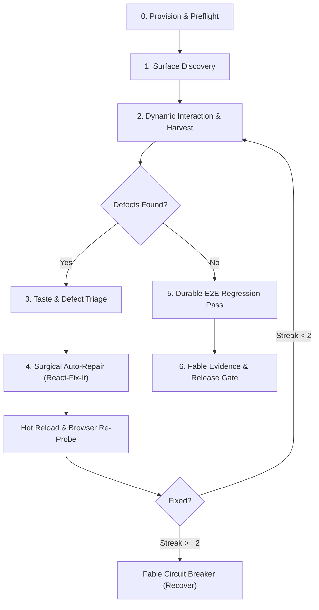

# Playbook: Autonomous UI/UX Polish & E2E Testing Round (`ui-ux-polish-round`)

**Version:** 1.0.0  
**Status:** Canonical Fable Lifecycle Playbook  
**Target Hosts:** Universal (Claude Code, Google Antigravity, OpenAI Codex, Cursor, Grok Build)  
**Methodology Standards:** OmniSkill Universal Spec · Poteto Mode · Caveman Precision · Fable v1.10.0  

---

## 1. Executive Summary & Thesis

Modern web development suffers from fragmented tooling across end-to-end (E2E) testing, visual regression checking, accessibility audits, and design polish. While tools exist in isolation (Playwright, Cypress, Lighthouse, Storybook), AI coding agents typically run a shallow compile check, declare success, and ship interfaces with subtle but critical flaws:
- Text clipping and overflow on mobile viewports.
- Broken active/focus states and sluggish transitions.
- Low-contrast color pairings that violate WCAG AA.
- Generic "AI slop" (clunky layouts, sterile copy, redundant card wrappers, missing empty states).
- Hydration errors and silent console exceptions.

The **UI/UX Polish Round** is an aggressive, closed-loop, multi-tiered autonomous playbook designed for `get-fable`. It empowers any coding agent—regardless of underlying capability—to autonomously interact with a target application in a live browser, harvest visual and interactive defects down to individual pixels, formulate surgical code repairs, and re-verify until the interface meets an award-winning craft floor.

Token consumption is explicitly acknowledged as a deliberate engineering tradeoff: **aggressive deep verification burns tokens to prevent high-cost production regressions**.

---

## 2. OmniSkill Universal Specification (`SkillSpec.json`)

```json
{
  "$schema": "https://json-schema.org/draft/2020-12/schema",
  "name": "fable-ui-ux-polish",
  "version": "1.0.0",
  "purpose": "Drive an aggressive, closed-loop E2E testing and pixel-by-pixel UI/UX review round across live web interfaces, performing autonomous defect harvesting and surgical code remediation.",
  "baseline_failure": "Agents check if code compiles or unit tests pass, but ship interfaces with visual clipping, horizontal scrollbars, sluggish micro-interactions, broken responsive breakpoints, and generic AI design slop.",
  "triggers": {
    "positive": [
      "/Poteto Mode /caveman /get-fable now pls craft a perfect UI-UX Polish round",
      "craft a perfect UI-UX polish round",
      "run aggressive UI review loop and fix issues pixel by pixel",
      "execute end-to-end testing and polish the web UI with taste",
      "detect UI slop, test responsive layouts, and auto-repair frontend bugs"
    ],
    "negative": [
      "write a jest unit test for this helper function",
      "design a database schema for user profiles",
      "generate an SVG icon for the navbar"
    ]
  },
  "invariants": [
    "Never declare a UI fix complete without fresh browser rendering and interaction evidence.",
    "Never edit production UI code without capturing an initial baseline recording.",
    "Halt automated mutations immediately if failure streak reaches 2 (Fable Circuit Breaker).",
    "All E2E regression tests must be durable TypeScript artifacts under tests/e2e/.",
    "Zero horizontal scroll on viewports (375px mobile, 768px tablet, 1440px desktop).",
    "Hit targets must meet minimum 44x44 CSS pixels for interactive elements."
  ],
  "outputs": [
    ".agent-review/rounds/<id>/ (video recording, DOM mutation timeline, network HAR)",
    ".unslop/reports/preflight-summary.json (design contract & layout score)",
    "tests/e2e/polish-regression.e2e.ts (executable regression suite)",
    ".fable/evidence/ (passing Fable test and review evidence stamps)"
  ],
  "tools_required": [
    "agent-browser (CLI)",
    "e2e (@e2e-dev/web runner)",
    "unslop-preflight (CLI)",
    "impeccable (craft floor rules)"
  ]
}
```

---

## 3. Open-Source Engine Bake-Off & Browser Selection

### 3.1 Candidate Evaluation Matrix

Across 16 open-source projects evaluated for this engine:

| Candidate Repository | Language / Runtime | Primary Strength | Weakness for Agentic Pipeline | Verdict |
|---|---|---|---|---|
| **`vercel-labs/agent-browser`** | Node.js / Bun (CLI) | Fast, agent-native accessible DOM snapshots (`@e1`), video recording, network HAR, timeline injection | None in JS/TS environments; lightweight | **CANONICAL WINNER (The Perfect Browser)** |
| **`browser-use/browser-use`** | Python | Vision-first coordinate fallback & deep LLM multi-modal navigation | Heavy Python stack, langchain overhead, slow cold start in JS/TS repos | Inspiration: Multi-modal coordinate fallback |
| **`lightpanda-io/browser`** | Zig / C | Ultra-fast headless DOM engine (sub-10ms startup) | Incomplete CSS layout and canvas rendering; cannot evaluate pixel aesthetics | Inspiration: Pre-crawl route discovery |
| **`tester-army/e2e`** | TypeScript / Playwright | Declarative agentic testing (`agent.act`, `agent.assert`), replay cache | Focuses on assertions rather than live video review sessions | **CANONICAL RUNNER for durable E2E assertions** |
| **`nanobrowser` & `BrowserSkill`** | TypeScript / Python | Accessibility tree simplification | Extension-bound or platform-specific | Inspiration: Semantic node tagging |
| **`CloakHQ/CloakBrowser` & `camofox`** | Rust / Node.js | Anti-fingerprinting & bot mitigation | Overkill for local dev, valuable for Cloudflare/Turnstile staging environments | Inspiration: Session persistence & cookie jar |
| **`browser-harness` & `computer-harness`**| Python / Go | Execution sandboxing & containerized isolation | Heavy virtualization footprint | Inspiration: Process timeout fencing |
| **`chaijs/chai`** | JavaScript | Fluent BDD assertion semantics | Assertion library only | Inspiration: UX assertion vocabulary |
| **`jackwener/OpenCLI`** | Rust | CLI wrapping | Wrapper only | Excluded |
| **`h4ckf0r0day/obscura`** | Go | Stealth evasion | Security scanning specific | Excluded |
| **`Skyvern-AI/skyvern`** | Python | Computer vision automation | High cloud API latency | Excluded |
| **`citrolabs/ego-lite`** | TypeScript | Minimal browser runner | Lacks video capture | Excluded |
| **`browseros-ai/BrowserOS`** | Rust / C++ | Tab management OS | Heavyweight desktop client | Excluded |
| **`yinnho/aginxbrowser`** | TypeScript | Browser gateway | Proxy routing layer | Excluded |

### 3.2 The Architectural Synthesis
- **The Core Engine**: **`vercel-labs/agent-browser`** is the primary interactive driver for live exploration, DOM dynamics, video recording, and pixel inspection.
- **The Assertion & Replay Engine**: **`@e2e-dev/web` (`tester-army/e2e`)** writes and runs permanent, durable regression tests that cache successful agent steps.
- **Architectural Borrowing**:
  1. *From `lightpanda`*: Lightning-fast preliminary crawl to map routes and anchor tags without rendering overhead.
  2. *From `browser-use`*: Coordinate-based visual fallback when elements are encapsulated in shadow DOMs or canvas.
  3. *From `CloakBrowser`*: Local storage and auth state preservation across rounds.
  4. *From `computer-harness`*: Deterministic 30s timeout guards per action.

---

## 4. Loop & Iteration Engine Architecture

Testing and polishing a UI cannot be done in a single one-off pass. It requires an iterative feedback loop:



### 4.1 Integration of Loop Frameworks
- **`ui-review-loop`**: Standardizes the round lifecycle (`start` -> `run` -> `stop`), producing verifiable `.agent-review/` packages containing video, DOM snapshots, and network traces.
- **`loop-engineering` & `loopy`**: Enforces strict stopping conditions:
  - Max loop count: 5 iterations.
  - Per-defect fix attempts: 2 attempts before escalating to architectural rethink (`principle-attack-the-premise`).
  - Budget cap: Explicit timeout and action fences.
- **`react-fix-it` & `MicheleBertoli`**: Extracts the exact component hierarchy from React Fiber / DOM attributes to patch the source file rather than guessing.
- **`unslop-preflight`**: Runs before and after edits to audit design token conformance, CSS layout resilience, and z-index ordering.

---

## 5. Taste, Aesthetic Polish & Real User Empathy

An agent running this playbook must not behave like a mechanical robot looking only for `200 OK` status codes. It acts as an **award-winning design director and real user with impeccable taste**:

### 5.1 The 19 Interface Polish Principles (Integrated from `impeccable` & `anti-ui-slop`)
1. **Visual Hierarchy**: Clear typography scale with distinct contrast between titles, body, and captions.
2. **Layout Rhythm**: Strict adherence to a 4px/8px spatial grid. No arbitrary `margin: 13px`.
3. **No Viewport Bleed**: Zero horizontal scrolling across standard viewports (375px, 768px, 1024px, 1440px).
4. **Touch Target Accessibility**: Minimum 44x44 CSS pixels for all clickable/tappable elements.
5. **Contrast Compliance**: WCAG AA ratio (minimum 4.5:1 for normal text, 3:1 for large text).
6. **Interaction States**: Every interactive element must render distinctive `:hover`, `:active`, and `:focus-visible` styles.
7. **Transition Budget**: UI transitions must be snappy (`150ms - 250ms`, `cubic-bezier(0.16, 1, 0.3, 1)`). Never exceed 300ms for routine state changes.
8. **Anti-UI-Slop Copy**: Eradicate AI filler copy ("Welcome to our platform", "Get started by doing...", "Click here"). Replace with concise, functional microcopy.
9. **Component States**: Full coverage of 4 mandatory states: Empty, Loading (skeleton shimmer, not raw spinners), Error (with clear remediation), and Populated.
10. **Z-Index Reasonableness**: Standardized layers (`1: base`, `10: dropdown`, `50: header/nav`, `100: modal`, `200: toast`). Eliminate `z-index: 999999`.

---

## 6. The 6-Stage Autonomous Execution Pipeline

### Stage 0: Zero-Config Provisioning & Design Preflight
1. **Auto-Installer Guard**:
   Check for installed tools. If missing, auto-install immediately via Bun:
   ```bash
   which agent-browser || bun add -g agent-browser
   which unslop-preflight || bun add -g unslop-preflight
   which e2e || bun add -d e2e @e2e-dev/web
   ```
2. **Contract Ingestion**:
   Inspect `PRODUCT.md` and `DESIGN.md`. If missing, generate baseline contracts via `unslop-preflight init`.
3. **Static Preflight Scan**:
   ```bash
   bunx unslop-preflight scan src --strict --feel
   ```

### Stage 1: Surface Discovery & Route Inventory
1. Detect web server running port (e.g., `http://127.0.0.1:3000` or `5173`). If offline, launch background dev server.
2. Crawl routes and interactive views to build a screen inventory:
   - Public landing / marketing.
   - Authentication flows (login, register).
   - Core application dashboard.
   - Modals, drawers, and nested dropdown views.

### Stage 2: Dynamic Interaction & Defect Harvesting
1. Launch `agent-browser` recording round:
   ```bash
   agent-browser open "http://127.0.0.1:3000" --record --viewport 1440x900
   ```
2. Execute aggressive exploration charters:
   - Rapid clicking, form fuzzing, tab navigation.
   - Mobile viewport switch (`agent-browser viewport 375x812`).
   - Network throttling simulation to observe loading states.
3. Harvest all defects into a structured JSON/TOON ledger:
   - Visual clipping, text overflow.
   - Console errors and network 4xx/5xx failures.
   - Contrast and layout failures.

### Stage 3: Taste & Defect Triage
1. Classify harvested issues into priority buckets:
   - **P0 - Blocker**: Page crash, unhandled runtime exception, unreachable flow.
   - **P1 - UX & Accessibility**: Broken mobile layout, clipping, illegible text, unresponsive buttons.
   - **P2 - Aesthetic Slop**: Misaligned grid, missing focus rings, generic filler copy, abrupt animation.

### Stage 4: Closed-Loop Surgical Auto-Repair
1. Apply the **Laziness Protocol** (`principle-laziness-protocol`): smallest possible diff that completely eliminates the defect.
2. Modify source components (Tailwind classes, CSS variables, React props).
3. Hot-reload and verify live rendering immediately via `agent-browser`:
   ```bash
   agent-browser snapshot --diff
   ```
4. If the fix fails twice, invoke `fable-recover` and rethink the architectural premise.

### Stage 5: Durable E2E Regression Codification & Fable Evidence
1. Synthesize verified flows into permanent tests in `tests/e2e/polish-regression.e2e.ts`.
2. Run test suite:
   ```bash
   bunx e2e run tests/e2e/polish-regression.e2e.ts
   ```
3. Record fresh Fable evidence:
   ```bash
   bun ./bin/get-fable.js evidence pass test "e2e & agent-browser" "100% UI/UX polish round verified across desktop & mobile"
   bun ./bin/get-fable.js evidence pass review "impeccable craft-floor" "Verified zero UI slop, contrast AA, and responsive rhythm"
   ```

---

## 7. Zero-Config Auto-Installer Implementation Script

To make launching the playbook as easy as running a single command, `get-fable` provides the standalone provisioner script `scripts/ui-polish-provision.sh`:

```bash
#!/usr/bin/env bash
set -euo pipefail

echo "=== [Fable] UI/UX Polish Round Auto-Provisioner ==="

# Check runtime
if ! command -v bun &> /dev/null; then
  echo "❌ Error: Bun runtime is required for get-fable."
  exit 1
fi

# 1. agent-browser CLI
if ! command -v agent-browser &> /dev/null; then
  echo "📦 Installing agent-browser CLI globally..."
  bun add -g agent-browser
  agent-browser install || true
else
  echo "✔ agent-browser is already installed."
fi

# 2. unslop-preflight CLI
if ! command -v unslop-preflight &> /dev/null; then
  echo "📦 Installing unslop-preflight globally..."
  bun add -g unslop-preflight
else
  echo "✔ unslop-preflight is already installed."
fi

# 3. Project-level E2E dependencies
if [ -f "package.json" ]; then
  if ! bun pm ls | grep -q "e2e"; then
    echo "📦 Adding e2e and @e2e-dev/web to local devDependencies..."
    bun add -d e2e @e2e-dev/web
  else
    echo "✔ e2e runner is present in project."
  fi
fi

echo "✔ All UI/UX polish tools successfully provisioned!"
```

---

## 8. Fable Lifecycle Integration

This playbook is natively accessible within `get-fable` via:
```bash
# View recipe details
bun ./bin/get-fable.js recipes inspect ui-ux-polish-round

# Execute lifecycle routing
bun ./bin/get-fable.js route "craft a perfect UI-UX polish round" --apply
```

The recipe steps link directly to Fable's canonical state machine:
`fable-discover` $\rightarrow$ `fable-plan` $\rightarrow$ `fable-execute` $\rightarrow$ `fable-loop` $\rightarrow$ `fable-verify` $\rightarrow$ `fable-review` $\rightarrow$ `fable-release`.
Every recorded round produces immutable evidence stored in `.fable/evidence/`, guaranteeing that no UI changes can be claimed as done without fresh machine-checked proof.
