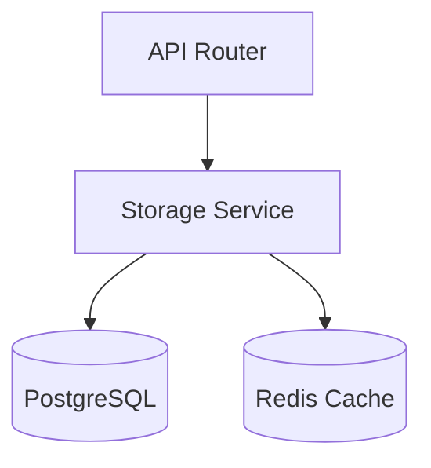

# Example: Architecture Proposal Artifact

```markdown
# Storage Engine Architecture

## Component Graph

```mermaid
graph TD
  API["API Router"] --> Svc["Storage Service"]
  Svc --> DB[("PostgreSQL")]
  Svc --> Cache[("Redis Cache")]
```
```
