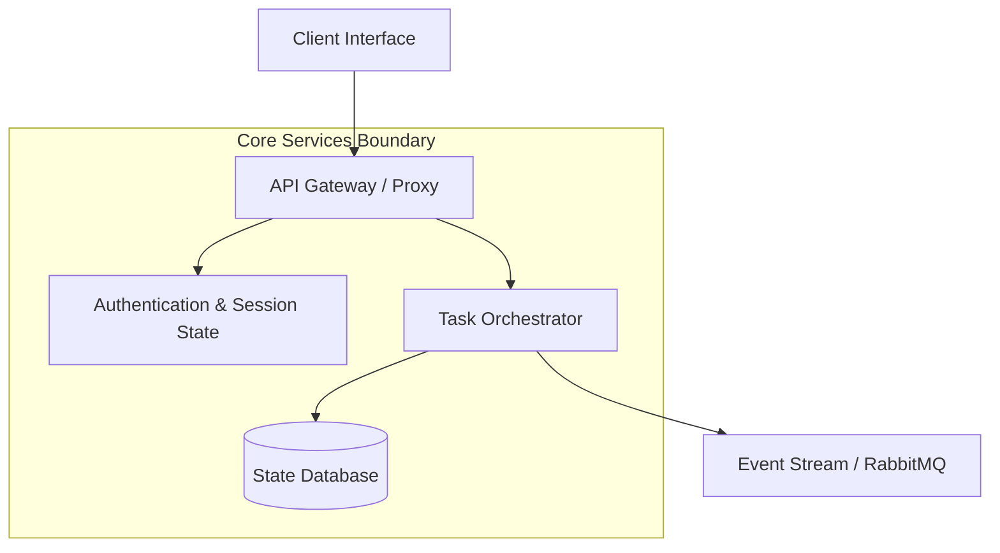

# Artifact Composition & Visual Presentation Guide

## Purpose
This guide establishes formal rules for composing technical artifacts, architectural diagrams, interactive widgets, and structured documents so that outputs are accessible, responsive, self-contained, and immediately usable.

## Core Composition Principles

### 1. Structure and Visual Hierarchy
- **Header Block**: Every artifact must open with a single clear level-1 header, a concise executive summary paragraph, and an optional metadata block.
- **Section Anchoring**: Use level-2 headers (`##`) for primary domains and level-3 headers (`###`) for subcomponents. Avoid deeply nested (>4) heading structures.
- **Progressive Chunking**: Break dense technical explanations into distinct visual surfaces: bulleted requirements, comparison tables, fenced code blocks, and visual diagrams.

### 2. Mermaid Diagram Construction
When illustrating architecture, sequence flows, or state machines with Mermaid:
- **Node Quoting**: Always quote node labels that contain punctuation, parentheses, brackets, or spaces (e.g. `nodeA["Client Gateway (HTTPS/2)"] --> nodeB["Service Mesh"]`).
- **Directional Clarity**: Use top-down (`graph TD`) for hierarchies and left-to-right (`graph LR`) for sequential pipelines and dataflows.
- **Subgraphs**: Encapsulate trust boundaries, deployment tiers, and microservices inside named `subgraph` blocks with clear boundary labels.
- **Styling Tokens**: Apply semantic class definitions with high-contrast borders and fills compatible with both light and dark themes.

### 3. Responsive Data Tables
- Use Markdown tables for multi-attribute comparisons, decision matrices, and risk registries.
- Align columns intentionally: left-align descriptive text, center status flags, and right-align numbers/metrics.
- Keep table cell content concise; use reference footnotes for extensive commentary.

### 4. Alert Callouts and Highlights
Use GitHub-flavored alert callouts strategically to emphasize critical engineering details:
- `> [!NOTE]`: Essential background context and rationale.
- `> [!IMPORTANT]`: Invariants, critical constraints, and mandatory preconditions.
- `> [!WARNING]`: Breaking changes, deprecations, and operational hazards.
- `> [!CAUTION]`: High-risk actions, irreversible migrations, and data safety warnings.

### 5. Document Integrity and Sanitization
- Never inline private credentials, raw environment tokens, or user-absolute local filesystem paths.
- Embed code snippets with appropriate language tags for syntax highlighting.
- Maintain mathematical precision using KaTeX notation with properly escaped literal dollar signs (`\$`).
