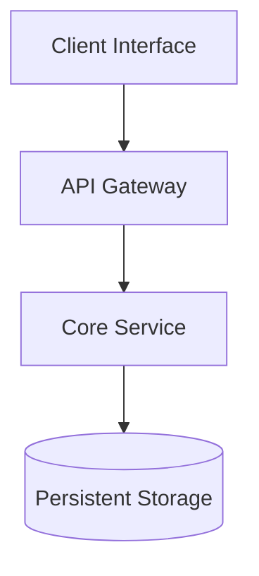

# Technical Proposal: [Title]

## Executive Summary
[Concise 2-3 sentence overview of the proposal, problem addressed, and expected technical outcome]

## Problem Statement & Context
- **Current State**: [Describe current architecture and pain points]
- **Target Goal**: [Describe desired capabilities and success metrics]

## Proposed Architecture

## Key Architectural Decisions & Trade-Offs
| Decision | Selected Approach | Trade-Offs & Rationale |
|---|---|---|
| Storage Layer | [e.g. PostgreSQL] | High consistency and ACID guarantees vs schema rigidity |
| Authentication | [e.g. OAuth 2.1 PKCE] | Secure delegated authorization without bearer token leakage |

## Implementation Plan & Milestones
- [ ] Milestone 1: [Core schema and data migrations]
- [ ] Milestone 2: [Service implementation and unit testing]
- [ ] Milestone 3: [End-to-end integration and release gate validation]
